# IS1_TP7
## 1. Diagramas de Secuencia

### a. ingreso de nuevo cliente
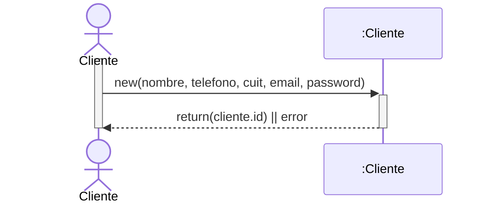
```mermaid
sequenceDiagram
    actor Cliente as Cliente
    participant C as :Cliente

    activate Cliente
    Cliente->>+C: new(nombre, telefono, cuit, email, password)
    C-->>-Cliente: return(cliente.id) || error
    deactivate Cliente
```

### b. registro de nuevo cliente
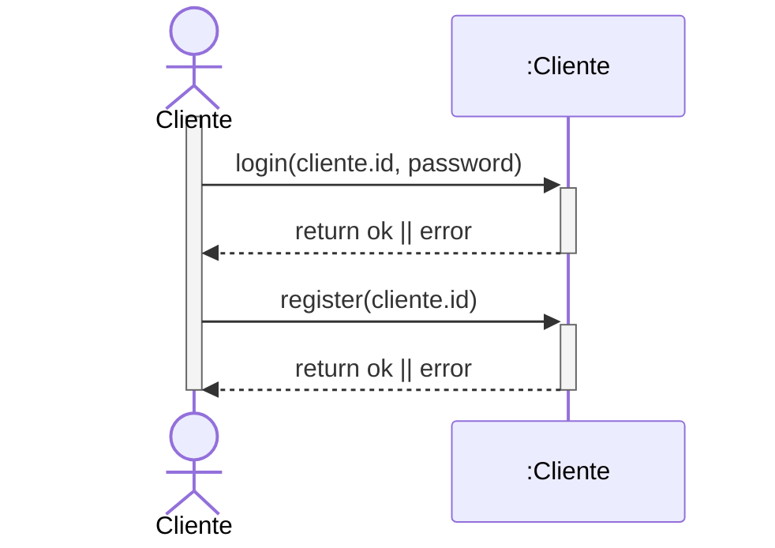
```mermaid
sequenceDiagram
    actor Cliente as Cliente
    participant C as :Cliente

    activate Cliente
    Cliente->>+C: login(cliente.id, password)
    C-->>-Cliente: return ok || error

    Cliente->>+C: register(cliente.id)
    C-->>-Cliente: return ok || error
    deactivate Cliente
```

### c. acceso de nuevo cliente
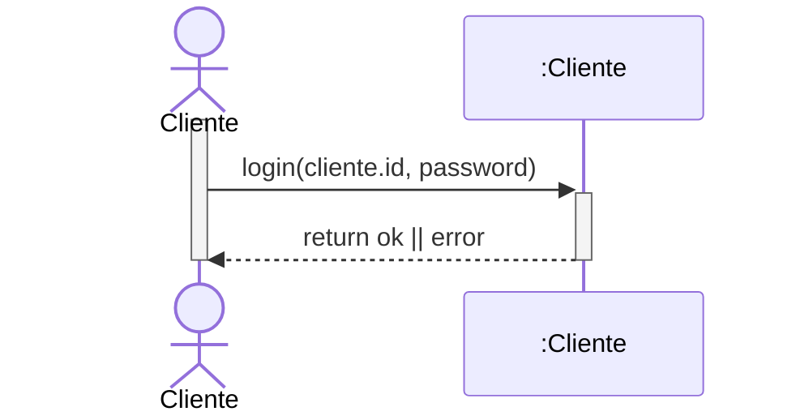
```mermaid
sequenceDiagram
    actor Cliente as Cliente
    participant C as :Cliente

    activate Cliente
    Cliente->>+C: login(cliente.id, password)
    C-->>-Cliente: return ok || error
    deactivate Cliente
```

### d. cambio de password de cliente
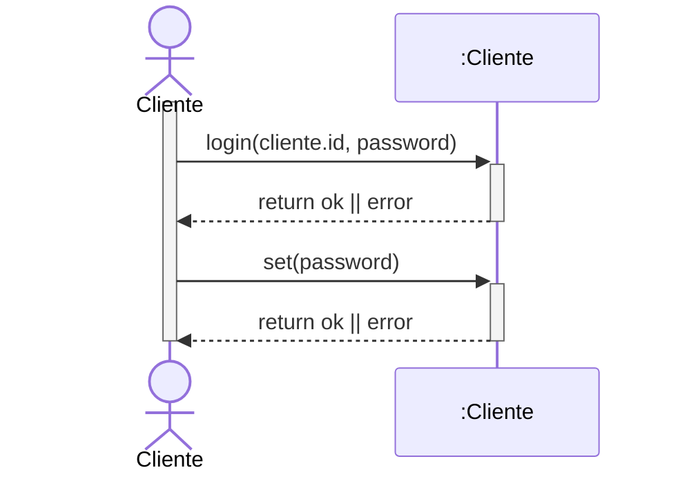
```mermaid
sequenceDiagram
    actor Cliente as Cliente
    participant C as :Cliente

    activate Cliente
    Cliente->>+C: login(cliente.id, password)
    C-->>-Cliente: return ok || error

    Cliente->>+C: set(password)
    C-->>-Cliente: return ok || error
    deactivate Cliente
```

### e. actualizacion de datos de cliente
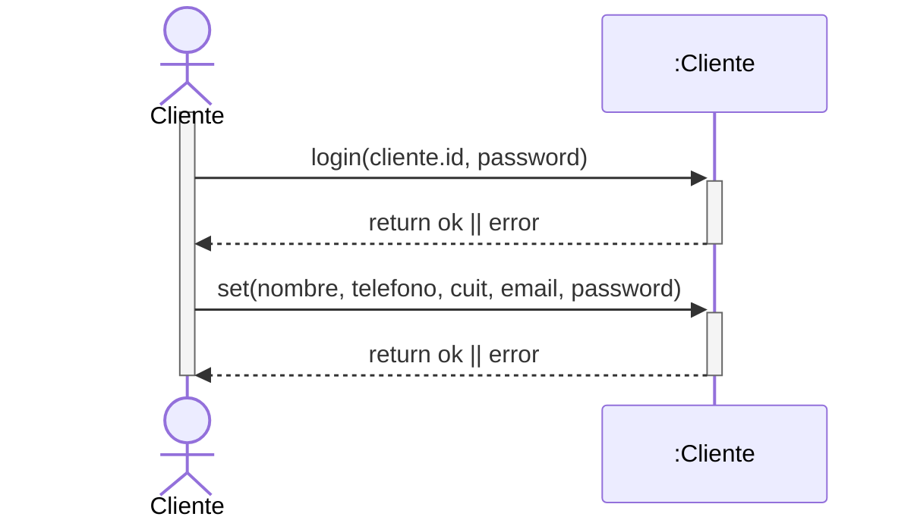
```mermaid
sequenceDiagram
    actor Cliente as Cliente
    participant C as :Cliente

    activate Cliente
    Cliente->>+C: login(cliente.id, password)
    C-->>-Cliente: return ok || error

    Cliente->>+C: set(nombre, telefono, cuit, email, password)
    C-->>-Cliente: return ok || error
    deactivate Cliente
```

### f. abrir nuevo ticket
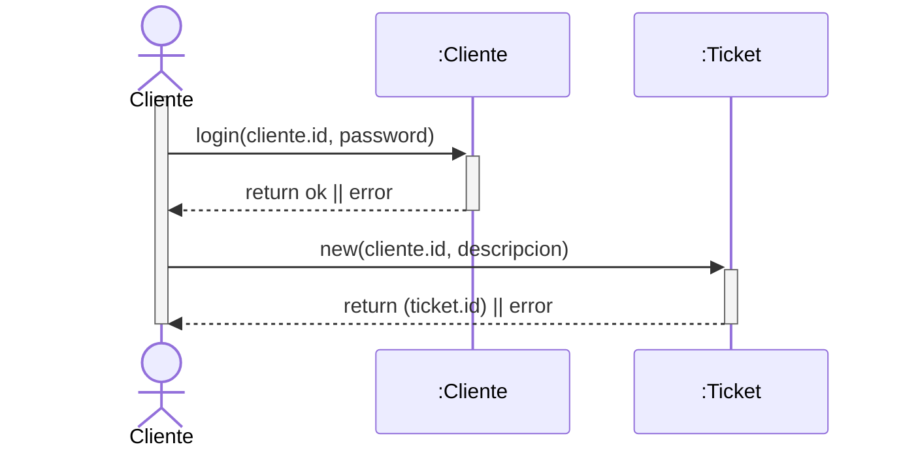
```mermaid
sequenceDiagram
    actor Cliente as Cliente
    participant C as :Cliente
    participant T as :Ticket

    activate Cliente
    Cliente->>+C: login(cliente.id, password)
    C-->>-Cliente: return ok || error

    Cliente->>+T: new(cliente.id, descripcion)
    T-->>-Cliente: return (ticket.id) || error
    deactivate Cliente
```

### g. actualizar ticket
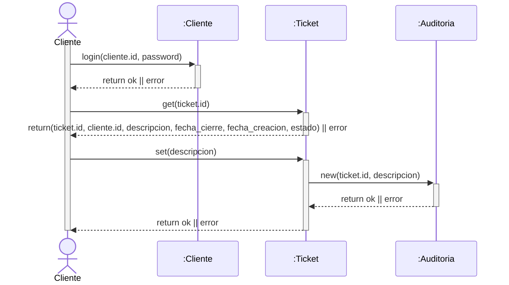
```mermaid
sequenceDiagram
    actor Cliente as Cliente
    participant C as :Cliente
    participant T as :Ticket
    participant A as :Auditoria

    activate Cliente
    Cliente->>+C: login(cliente.id, password)
    C-->>-Cliente: return ok || error

    Cliente->>+T: get(ticket.id)
    T-->>-Cliente: return(ticket.id, cliente.id, descripcion, fecha_cierre, fecha_creacion, estado) || error

    Cliente->>+T: set(descripcion)
    T->>+A: new(ticket.id, descripcion)
    A-->>-T: return ok || error
    T-->>-Cliente: return ok || error
    deactivate Cliente
```

### h. consultar tickets existentes
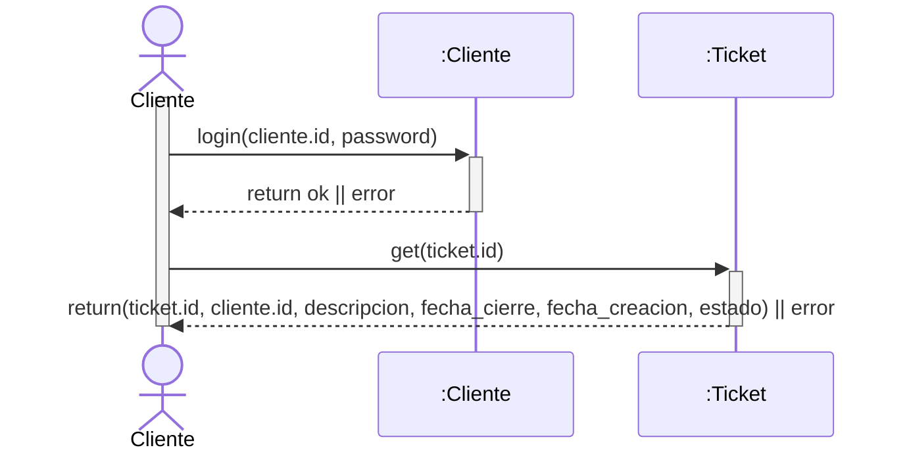
```mermaid
sequenceDiagram
    actor Cliente as Cliente
    participant C as :Cliente
    participant T as :Ticket

    activate Cliente
    Cliente->>+C: login(cliente.id, password)
    C-->>-Cliente: return ok || error

    Cliente->>+T: get(ticket.id)
    T-->>-Cliente: return(ticket.id, cliente.id, descripcion, fecha_cierre, fecha_creacion, estado) || error
    deactivate Cliente
```

### i. dar de baja ticket
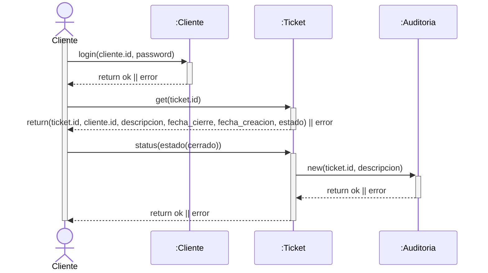
```mermaid
sequenceDiagram
    actor Cliente as Cliente
    participant C as :Cliente
    participant T as :Ticket
    participant A as :Auditoria

    activate Cliente
    Cliente->>+C: login(cliente.id, password)
    C-->>-Cliente: return ok || error

    Cliente->>+T: get(ticket.id)
    T-->>-Cliente: return(ticket.id, cliente.id, descripcion, fecha_cierre, fecha_creacion, estado) || error

    Cliente->>+T: status(estado(cerrado))
    T->>+A: new(ticket.id, descripcion)
    A-->>-T: return ok || error
    T-->>-Cliente: return ok || error
    deactivate Cliente
```

---

## 2. Diagramas de Actividad

### a. Ingreso de nuevo cliente
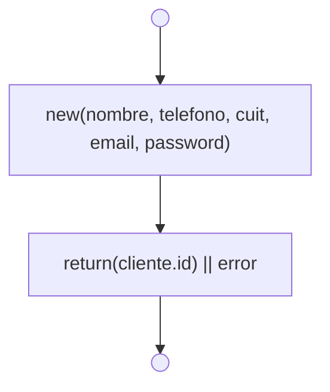
```mermaid
flowchart TD
    Start(( )) --> A["new(nombre, telefono, cuit, email, password)"]
    A --> B["return(cliente.id) || error"]
    B --> End(( ))
```

### b. Registro de nuevo cliente
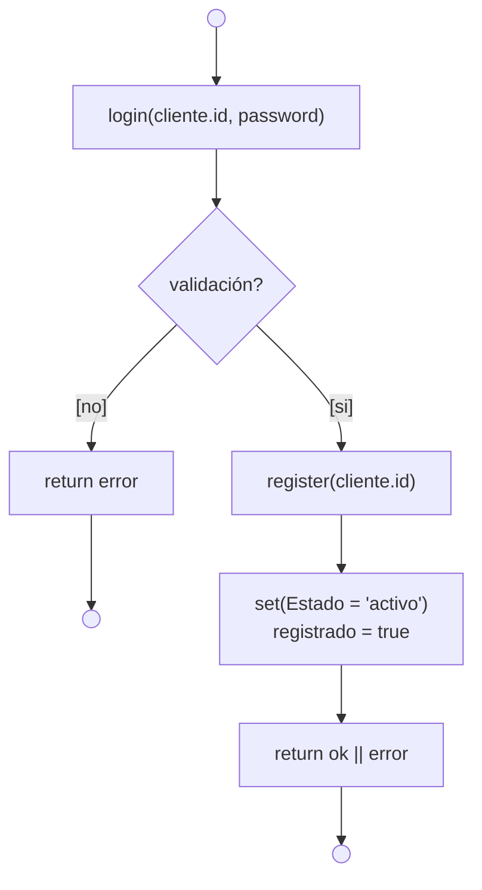
```mermaid
flowchart TD
    Start(( )) --> A["login(cliente.id, password)"]
    A --> Decision{validación?}
    Decision -- [no] --> Error["return error"] --> EndError(( ))
    Decision -- [si] --> B["register(cliente.id)"]
    B --> C["set(Estado = 'activo')<br>registrado = true"]
    C --> D["return ok || error"]
    D --> End(( ))
```

### c. Acceso de nuevo cliente
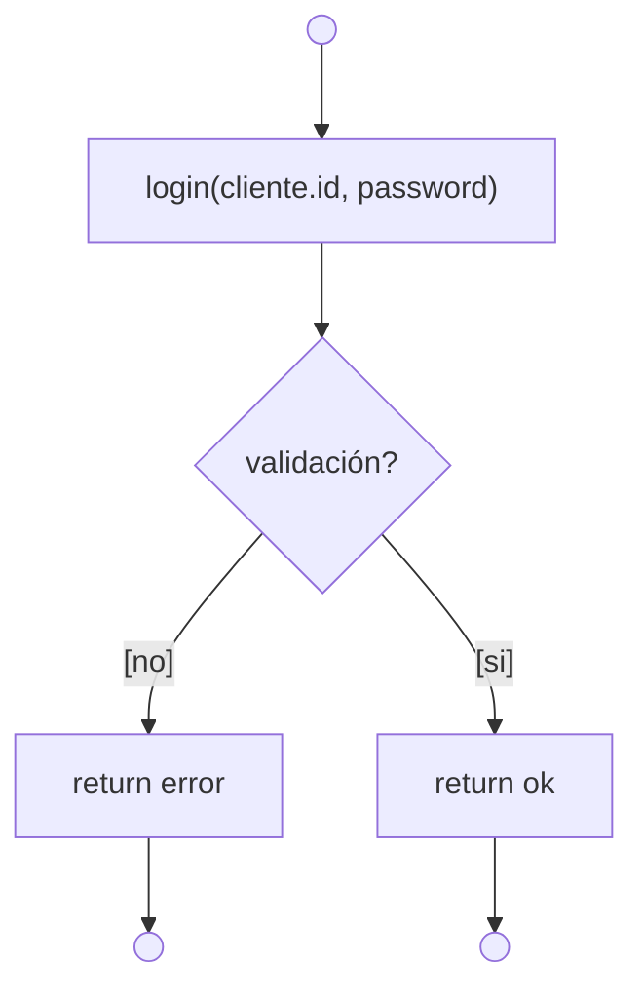
```mermaid
flowchart TD
    Start(( )) --> A["login(cliente.id, password)"]
    A --> Decision{validación?}
    Decision -- [no] --> Error["return error"] --> EndError(( ))
    Decision -- [si] --> OK["return ok"] --> End(( ))
```

### d. Cambio de password de cliente
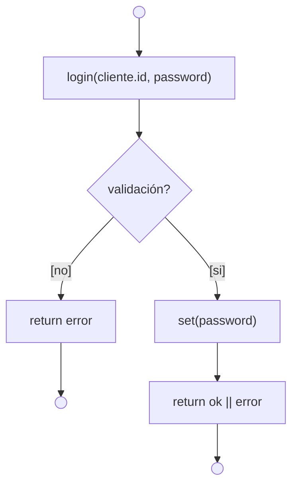
```mermaid
flowchart TD
    Start(( )) --> A["login(cliente.id, password)"]
    A --> Decision{validación?}
    Decision -- [no] --> Error["return error"] --> EndError(( ))
    Decision -- [si] --> B["set(password)"]
    B --> C["return ok || error"]
    C --> End(( ))
```

### e. Actualización de datos de cliente
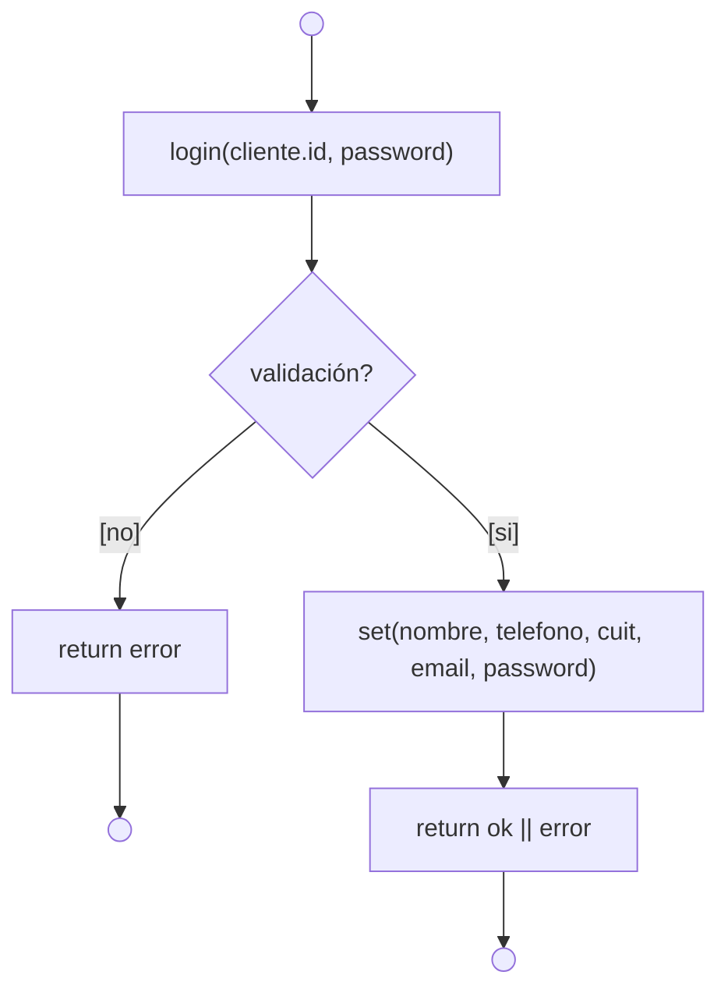
```mermaid
flowchart TD
    Start(( )) --> A["login(cliente.id, password)"]
    A --> Decision{validación?}
    Decision -- [no] --> Error["return error"] --> EndError(( ))
    Decision -- [si] --> B["set(nombre, telefono, cuit, email, password)"]
    B --> C["return ok || error"]
    C --> End(( ))
```

### f. Abrir nuevo ticket
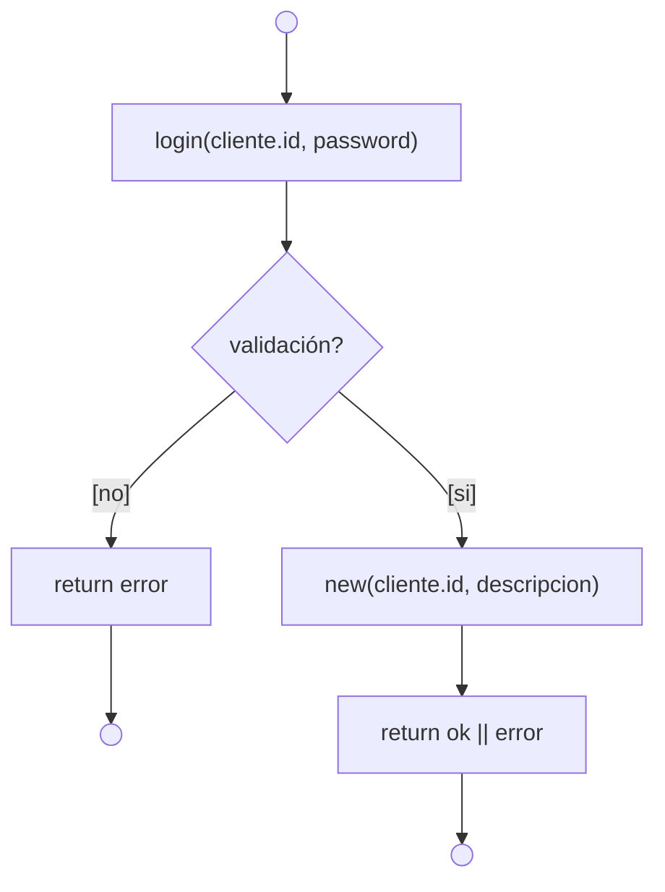
```mermaid
flowchart TD
    Start(( )) --> A["login(cliente.id, password)"]
    A --> Decision{validación?}
    Decision -- [no] --> Error["return error"] --> EndError(( ))
    Decision -- [si] --> B["new(cliente.id, descripcion)"]
    B --> C["return ok || error"]
    C --> End(( ))
```

### g. Actualizar ticket
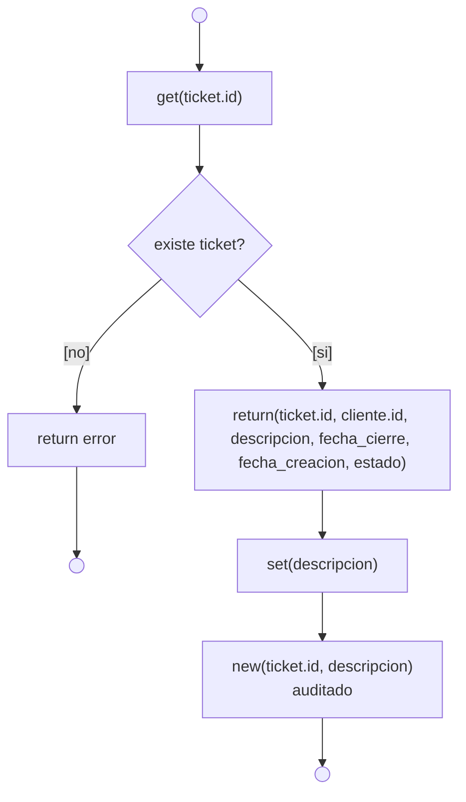
```mermaid
flowchart TD
    Start(( )) --> A["get(ticket.id)"]
    A --> Decision{existe ticket?}
    Decision -- [no] --> Error["return error"] --> EndError(( ))
    Decision -- [si] --> B["return(ticket.id, cliente.id, descripcion, fecha_cierre, fecha_creacion, estado)"]
    B --> C["set(descripcion)"]
    C --> D["new(ticket.id, descripcion)<br>auditado"]
    D --> End(( ))
```

### h. Consultar tickets existentes
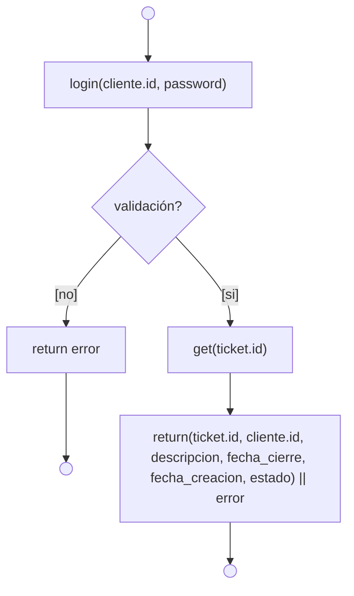
```mermaid
flowchart TD
    Start(( )) --> A["login(cliente.id, password)"]
    A --> Decision{validación?}
    Decision -- [no] --> Error["return error"] --> EndError(( ))
    Decision -- [si] --> B["get(ticket.id)"]
    B --> C["return(ticket.id, cliente.id, descripcion, fecha_cierre, fecha_creacion, estado) || error"]
    C --> End(( ))
```

### i. Borrar / Cerrar ticket
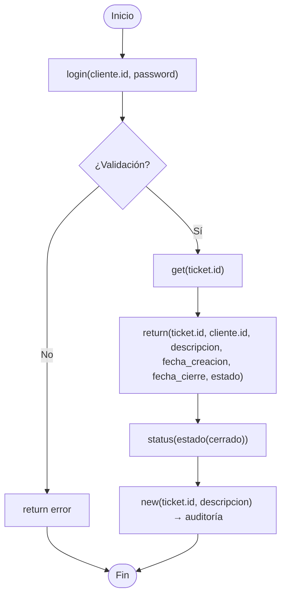
```mermaid
flowchart TD
    A([Inicio]) --> B["login(cliente.id, password)"]
    B --> C{¿Validación?}
    C -- No --> C1["return error"]
    C1 --> Z([Fin])
    C -- Sí --> D["get(ticket.id)"]
    D --> E["return(ticket.id, cliente.id, descripcion, fecha_creacion, fecha_cierre, estado)"]
    E --> F["status(estado(cerrado))"]
    F --> G["new(ticket.id, descripcion) → auditoría"]
    G --> Z
```
---

## 3. Diagramas de Estados

### Diagrama de Estados del Cliente
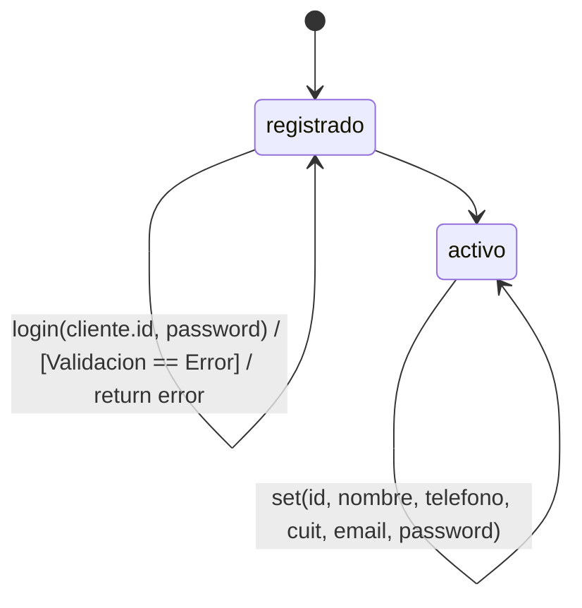
```mermaid
stateDiagram-v2
    [*] --> registrado
    registrado --> registrado : login(cliente.id, password) / [Validacion == Error] / return error
    registrado --> activo
    activo --> activo : set(password)
    activo --> activo : set(id, nombre, telefono, cuit, email, password)
```

### Diagrama de Estados de un Ticket
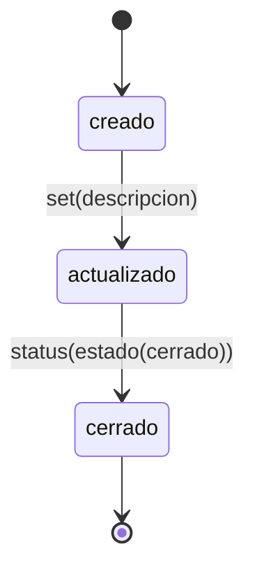
```mermaid
stateDiagram-v2
    [*] --> creado
    creado --> actualizado : set(descripcion)
    actualizado --> cerrado : status(estado(cerrado))
    cerrado --> [*]
```
