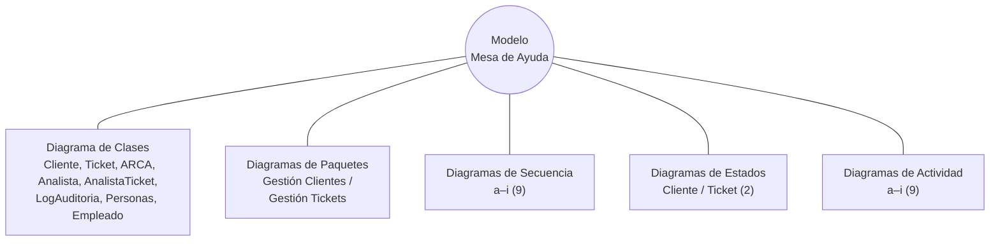

```mermaid
flowchart TB
    M(("Modelo<br/>Mesa de Ayuda"))

    %% Vista Estática
    DC["Diagrama de Clases<br/> Cliente, Ticket, ARCA,<br/>Analista, AnalistaTicket,<br/>LogAuditoria, Personas, Empleado"]
    DPk["Diagramas de Paquetes<br/> Gestión Clientes /<br/>Gestión Tickets"]

    %% Vista de Comportamiento

    DS["Diagramas de Secuencia<br/> a–i (9)"]
    DE["Diagramas de Estados<br/> Cliente / Ticket (2)"]
    DA["Diagramas de Actividad<br/> a–i (9)"]

    M --- DC
    M --- DPk
    M --- DS
    M --- DE
    M --- DA
```
````
