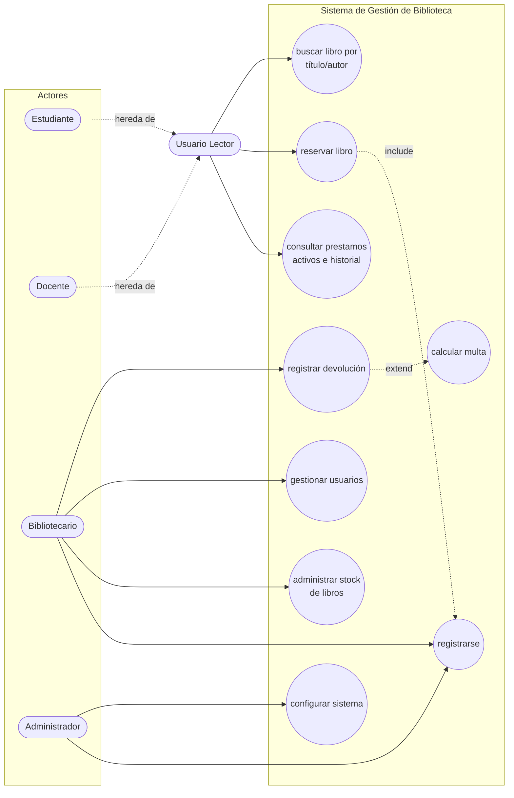

```mermaid
flowchart LR
    subgraph Actores
        EST([Estudiante])
        DOC([Docente])
        BIB([Bibliotecario])
        ADM([Administrador])
    end

    EST -.->|hereda de| ul
    DOC -.->|hereda de| ul
    ul([Usuario Lector])

    subgraph Sistema de Gestión de Biblioteca
        CU1((buscar libro por<br/>título/autor))
        CU2((reservar libro))
        CU3((consultar prestamos<br/>activos e historial))
        CU4((registrar devolución))
        CU5((calcular multa))
        CU6((gestionar usuarios))
        CU7((administrar stock<br/>de libros))
        CU8((configurar sistema))
        CU9((registrarse))
    end

    ul --> CU1
    ul --> CU2
    ul --> CU3
    CU2 -.->|include| CU9

    BIB --> CU4
    BIB --> CU6
    BIB --> CU7
    CU4 -.->|extend| CU5
    BIB --> CU9

    ADM --> CU8
    ADM --> CU9
```
