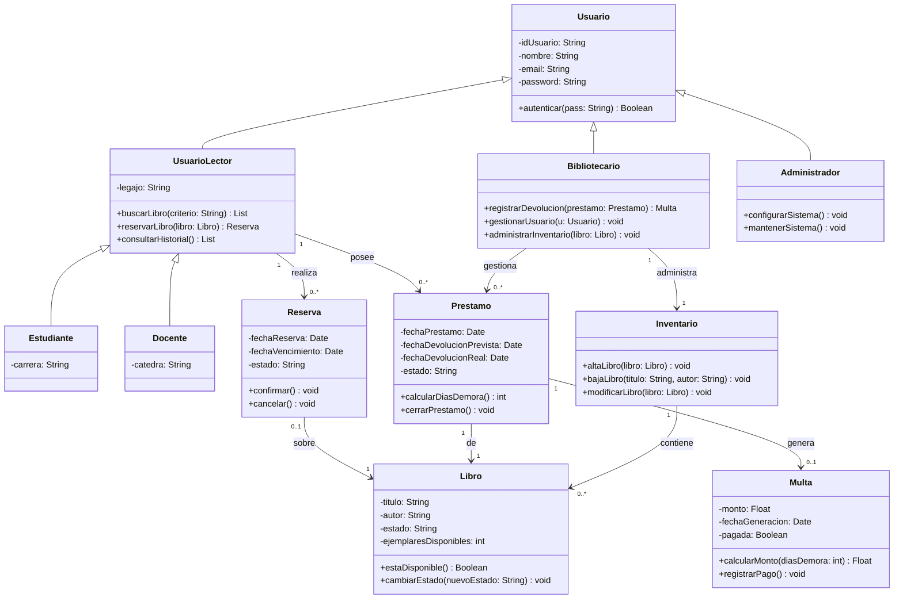

```mermaid
classDiagram
    class Usuario {
        -idUsuario: String
        -nombre: String
        -email: String
        -password: String
        +autenticar(pass: String) Boolean
    }

    class UsuarioLector {
        -legajo: String
        +buscarLibro(criterio: String) List
        +reservarLibro(libro: Libro) Reserva
        +consultarHistorial() List
    }

    class Estudiante {
        -carrera: String
    }

    class Docente {
        -catedra: String
    }

    class Bibliotecario {
        +registrarDevolucion(prestamo: Prestamo) Multa
        +gestionarUsuario(u: Usuario) void
        +administrarInventario(libro: Libro) void
    }

    class Administrador {
        +configurarSistema() void
        +mantenerSistema() void
    }

    class Libro {
        -titulo: String
        -autor: String
        -estado: String
        -ejemplaresDisponibles: int
        +estaDisponible() Boolean
        +cambiarEstado(nuevoEstado: String) void
    }

    class Reserva {
        -fechaReserva: Date
        -fechaVencimiento: Date
        -estado: String
        +confirmar() void
        +cancelar() void
    }

    class Prestamo {
        -fechaPrestamo: Date
        -fechaDevolucionPrevista: Date
        -fechaDevolucionReal: Date
        -estado: String
        +calcularDiasDemora() int
        +cerrarPrestamo() void
    }

    class Multa {
        -monto: Float
        -fechaGeneracion: Date
        -pagada: Boolean
        +calcularMonto(diasDemora: int) Float
        +registrarPago() void
    }

    class Inventario {
        +altaLibro(libro: Libro) void
        +bajaLibro(titulo: String, autor: String) void
        +modificarLibro(libro: Libro) void
    }

    Usuario <|-- UsuarioLector
    Usuario <|-- Bibliotecario
    Usuario <|-- Administrador
    UsuarioLector <|-- Estudiante
    UsuarioLector <|-- Docente

    UsuarioLector "1" --> "0..*" Reserva : realiza
    UsuarioLector "1" --> "0..*" Prestamo : posee
    Reserva "0..1" --> "1" Libro : sobre
    Prestamo "1" --> "1" Libro : de
    Prestamo "1" --> "0..1" Multa : genera
    Bibliotecario "1" --> "0..*" Prestamo : gestiona
    Bibliotecario "1" --> "1" Inventario : administra
    Inventario "1" --> "0..*" Libro : contiene
```
