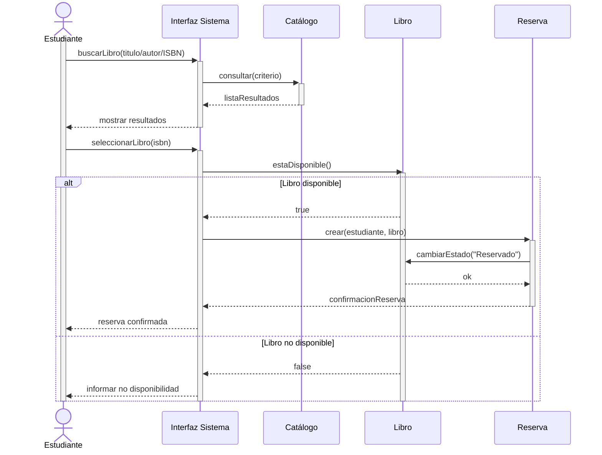

```mermaid
sequenceDiagram
    actor Est as Estudiante
    participant UI as Interfaz Sistema
    participant Cat as Catálogo
    participant Lib as Libro
    participant Res as Reserva

    activate Est
    Est->>+UI: buscarLibro(titulo/autor/ISBN)
    UI->>+Cat: consultar(criterio)
    Cat-->>-UI: listaResultados
    UI-->>-Est: mostrar resultados

    Est->>+UI: seleccionarLibro(isbn)
    UI->>Lib: estaDisponible()
    activate Lib
    alt Libro disponible
        Lib-->>UI: true
        UI->>+Res: crear(estudiante, libro)
        Res->>Lib: cambiarEstado("Reservado")
        Lib-->>Res: ok
        Res-->>-UI: confirmacionReserva
        UI-->>Est: reserva confirmada
    else Libro no disponible
        Lib-->>UI: false
        UI-->>Est: informar no disponibilidad
    end
    deactivate Lib
    deactivate UI
    deactivate Est
```
