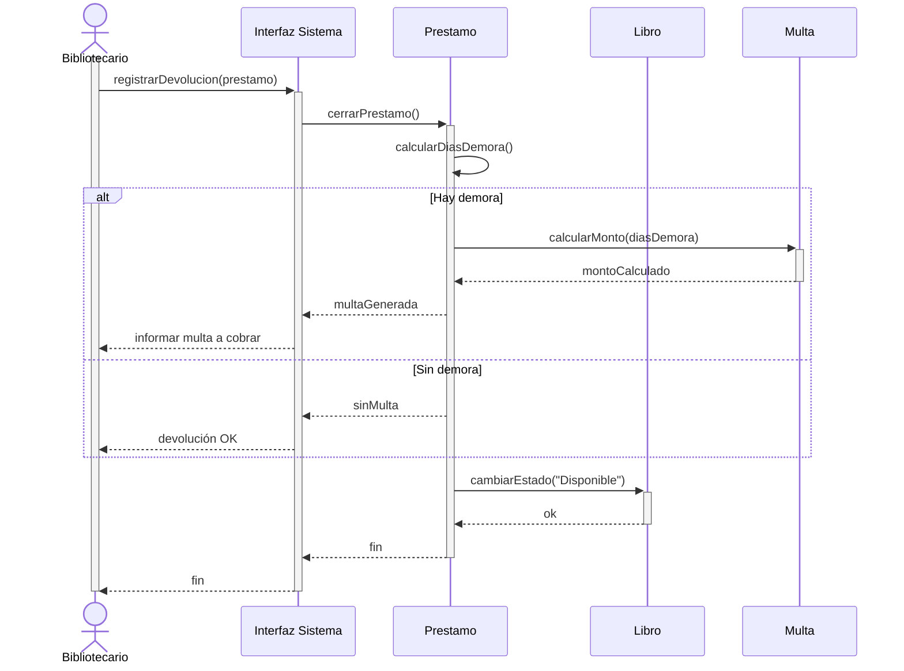

```mermaid
sequenceDiagram
    actor Bib as Bibliotecario
    participant UI as Interfaz Sistema
    participant Pre as Prestamo
    participant Lib as Libro
    participant Mul as Multa

    activate Bib
    Bib->>+UI: registrarDevolucion(prestamo)
    UI->>+Pre: cerrarPrestamo()
    Pre->>Pre: calcularDiasDemora()

    alt Hay demora
        Pre->>+Mul: calcularMonto(diasDemora)
        Mul-->>-Pre: montoCalculado
        Pre-->>UI: multaGenerada
        UI-->>Bib: informar multa a cobrar
    else Sin demora
        Pre-->>UI: sinMulta
        UI-->>Bib: devolución OK
    end

    Pre->>+Lib: cambiarEstado("Disponible")
    Lib-->>-Pre: ok
    Pre-->>-UI: fin
    UI-->>-Bib: fin
    deactivate Bib
```
