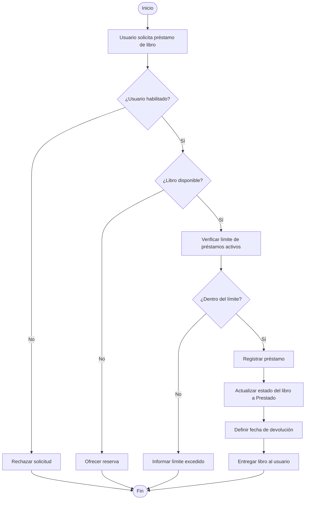

```mermaid
flowchart TD
    A([Inicio]) --> B[Usuario solicita préstamo de libro]
    B --> C{¿Usuario habilitado?}
    C -- No --> C1[Rechazar solicitud]
    C1 --> Z([Fin])
    C -- Sí --> D{¿Libro disponible?}
    D -- No --> D1[Ofrecer reserva]
    D1 --> Z
    D -- Sí --> E[Verificar límite de préstamos activos]
    E --> F{¿Dentro del límite?}
    F -- No --> F1[Informar límite excedido]
    F1 --> Z
    F -- Sí --> G[Registrar préstamo]
    G --> H[Actualizar estado del libro a Prestado]
    H --> I[Definir fecha de devolución]
    I --> J[Entregar libro al usuario]
    J --> Z
```
