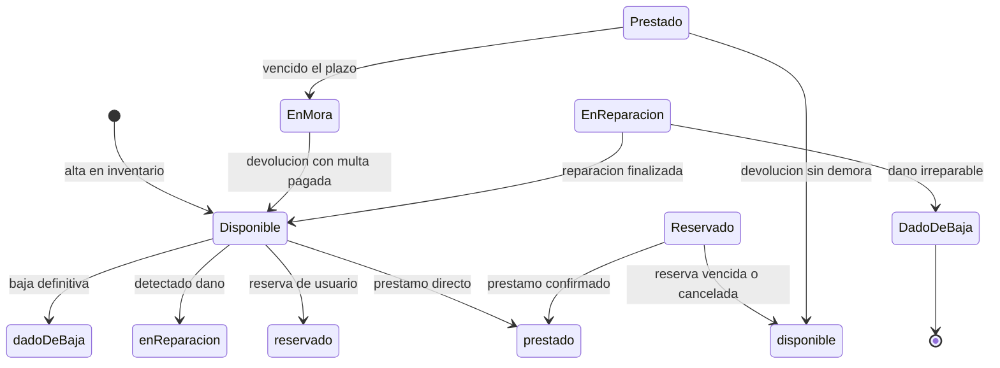

```mermaid
stateDiagram-v2
    [*] --> Disponible : alta en inventario

    Disponible --> reservado : reserva de usuario
    Disponible --> prestado : prestamo directo
    Disponible --> enReparacion : detectado dano
    Disponible --> dadoDeBaja : baja definitiva

    Reservado --> prestado : prestamo confirmado
    Reservado --> disponible : reserva vencida o cancelada

    Prestado --> disponible : devolucion sin demora
    Prestado --> EnMora : vencido el plazo

    EnMora --> Disponible : devolucion con multa pagada

    EnReparacion --> Disponible : reparacion finalizada
    EnReparacion --> DadoDeBaja : dano irreparable

    DadoDeBaja --> [*]
```
